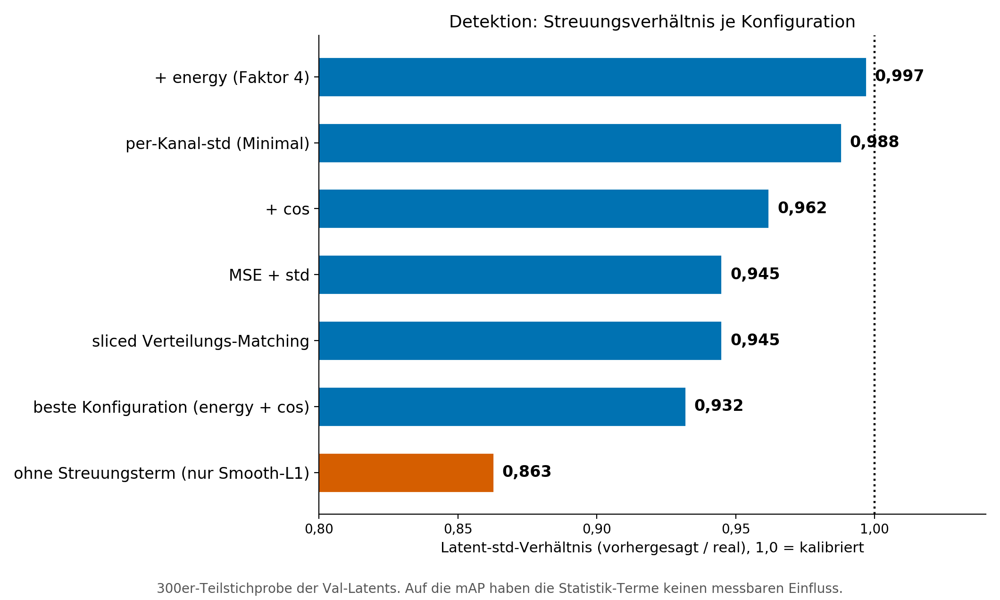

# BEV-Weltmodell: Vorhersage latenter BEV-Repräsentationen für das autonome Fahren

Transformer-basiertes Weltmodell, das die nächste latente BEV-Repräsentation
(kurz: Latent) aus den drei vorherigen Frames vorhersagt. Die Latents stammen
aus den eingefrorenen BEVFusion-Konfigurationen für Segmentierung und
Detektion (nuScenes), abgegriffen nach der Sensorfusion und vor den
Wahrnehmungsköpfen. Ausgewertet werden die Vorhersagen mit den jeweils
zugehörigen eingefrorenen Wahrnehmungsköpfen. Masterarbeit an der
Universität der Bundeswehr München.

## Kernergebnisse

| Metrik (Vollvalidierung, gegen die nuScenes-Annotation) | Persistenz | Weltmodell | Referenz (reales Latent) |
|---|---|---|---|
| Segmentierung (mIoU, 6 Klassen) | 0,4647 | **0,5898** | 0,6295 |
| Detektion (mAP) | 0,1696 | **0,3438** | 0,6858 |

- Zielfunktion: Für die Segmentierung reichen Smooth-L1 und der
  Streuungsterm aus. In der Detektion verbessern gezielte Zusatzterme
  die mAP. Details stehen im Abschnitt "Zielfunktion" am Ende dieses
  Dokuments.
- Rollout: Das Weltmodell liegt bei jedem Schritt bis k=10 über der
  Persistenz.
- Kopfadaptation: Auf Vorhersagen nachtrainierte Wahrnehmungsköpfe
  verbessern die Segmentierung um 0,011 mIoU und die Detektion um
  0,089 mAP. Die Werte wurden über mehrere Trainingsläufe bestimmt.
- Generative Varianten: CVAE und Flow Matching erzeugen unterschiedliche
  Stichproben. Die Punktmetrik liegt dabei nicht über dem
  deterministischen Modell.
- Laufzeit: Ein Vorhersageschritt benötigt auf einer TITAN RTX etwa
  4,4 ms für die Segmentierung und 11,5 ms für die Detektion.
  Der höchste gemessene PyTorch-Speicherbedarf liegt bei 266 MB.

## Repository-Struktur

```
├── Masterarbeit_VincentMann.pdf   # die vollständige Masterarbeit
├── train_linux.py            # Training (eine Codebasis lokal + Cluster)
├── inference.py              # Proxy-Evaluation Seg (Teilstichprobe mit 300
│                             #   Fenstern; mIoU, Streuungsverhältnis)
├── eval_full_val.py          # Vollvalidierung Seg (5743 Fenster)
├── rollout_eval.py           # autoregressiver Rollout
├── Code/                     # Modell-Module (Dataset, Embedding, Transformer,
│                             #   Output-/Upsampling-Head, Flow-Head, Loss)
├── tools/                    # Kopf-Adaptation: adapt_seg_head.py (Decoder,
│                             #   Seg) und adapt_det_head.py (TransFusion, Det)
├── bevfusion_patch/          # Latent-Extraktion/-Injektion: latent_saver.py
│                             #   + Hook-Anleitung (SAVE_/LOAD_BEV_LATENTS)
├── configs/                  # Beispiel-Configs (beste Betriebspunkte Seg/Det)
├── scripts_render/           # Beispiel-Render-Skript (Abb. 5.8 der Thesis)
│                             #   + gemeinsames Stylesheet thesis_style.py
├── img/                      # Abbildungen dieses Dokuments
├── environment.yml           # Conda-Referenzumgebung (Training/Inferenz)
└── requirements.txt          # dieselbe Umgebung als pip-Variante
```

## Setup

```bash
# Variante Conda (empfohlen):
conda env create -f environment.yml && conda activate bevwm
# Variante pip (Python 3.10, CUDA 12.1):
pip install -r requirements.txt
```

## Daten und Gewichte (nicht im Repo)

Aus Lizenzgründen enthält das Repo weder nuScenes-Daten und -Latents noch
BEVFusion-Gewichte und keine trainierten Checkpoints. Zum Reproduzieren:

1. nuScenes (v1.0-trainval): [nuscenes.org/nuscenes](https://www.nuscenes.org/nuscenes)
   (Download nach Registrierung, nuScenes-Lizenzbedingungen beachten).
2. BEVFusion: offizielles Repo [mit-han-lab/bevfusion](https://github.com/mit-han-lab/bevfusion)
   mit den offiziellen Seg- und Det-Gewichten (`bevfusion-seg.pth` /
   `bevfusion-det.pth`).
3. Latents extrahieren: über den `latent_saver`-Hook im
   BEVFusion-Modell (Env-Schalter `SAVE_BEV_LATENTS`; das Gegenstück
   `LOAD_BEV_LATENTS` injiziert Latents für die annotationsbasierte
   Evaluation). Der Hook stammt aus einer vorangegangenen Projektarbeit
   und liegt zur Reproduzierbarkeit unter
   [`bevfusion_patch/`](bevfusion_patch/) bei (Modul, Einbauanleitung,
   Aufrufbeispiele). Ergebnis: je Split ein Verzeichnis einzelner
   `.npy`-Dateien (Seg: 256×128×128, Det: 256×180×180, fp16).
4. Packen: `python -u Code/pack_latents.py --config <config> --split val
   --dtype float16` (idempotent; memmap-fähige Packs für den Loader).
5. Trainieren: `python -u train_linux.py --config configs/config_seg_beispiel.yaml`
   für den Segmentierungs- bzw.
   `--config configs/config_det_beispiel.yaml` für den
   Detektionsstrang (Pfade an die eigene Umgebung anpassen).
6. Evaluieren: `inference.py` (Proxy-Skala, 300 Fenster),
   `eval_full_val.py` (Vollvalidierung) und `rollout_eval.py`, jeweils
   Seg-Strang. Die annotationsverankerten Metriken (mIoU/mAP gegen die
   nuScenes-Annotation, für Det der einzige Messweg) laufen per
   Latent-Injektion im BEVFusion-Container (`LOAD_BEV_LATENTS`-Hook,
   siehe `bevfusion_patch/`).
7. Kopf-Adaptation (optional): `tools/adapt_seg_head.py` trainiert
   den Seg-Decoder, `tools/adapt_det_head.py` den TransFusion-Kopf auf
   Weltmodell-Vorhersagen nach. Weltmodell und Encoder bleiben dabei
   eingefroren (Thesis, Kapitel Kopfadaptation).

## Checkpoints

Trainierte Gewichte sind nicht Teil des Repos (Größe). Das Weltmodell
ist mit den Configs unter `configs/` aus den extrahierten Latents in
wenigen GPU-Stunden reproduzierbar (Seg ca. 6 M Parameter). Die in der
Thesis verwendeten Checkpoints (Seg- und Det-Betriebspunkt sowie
adaptierte Köpfe, fp16 ca. 11,5 MB je Modell) sind archiviert und auf
Anfrage verfügbar.

## Beispiel: Thesis-Figur rendern

`scripts_render/` zeigt den Aufbau der Thesis-Figuren (gemeinsames
Stylesheet `thesis_style.py`, kleine Ergebnis-JSONs als Datenquelle) am
Beispiel von Abbildung 5.8 (mIoU je Klasse):

```bash
python3 scripts_render/render_beispiel_klassen.py
```

## Zielfunktion: Welche Terme tragen

Die Loss-Ablationen wurden nach Abgabe der Arbeit auf einheitlichem
Protokoll vervollständigt (Vollvalidierung, ein Trainingsrezept, nur der
jeweils genannte Term geändert). Referenz ist in beiden Grafiken die
Minimal-Konfiguration aus Smooth-L1 und Streuungsterm.

Segmentierung: Zwei Terme genügen. Kein Zusatzterm verbessert die
Minimal-Konfiguration, ssim schadet sogar signifikant. Smooth-L1 trägt
die gesamte Vorhersageleistung. Ohne ihn fällt das Modell auf das
Persistenz-Niveau zurück, weil das Gate dann nur noch kopiert.


Der Streuungsterm gehört trotzdem dazu. Für die Punktmetrik ist er
nahezu neutral, sein Wert zeigt sich im autoregressiven Rollout. Ohne
ihn fällt das Streuungsverhältnis durch Regression zur Mitte auf ein
Plateau um 0,77, mit ihm bleibt es über den gesamten Horizont nahe 1,0.
Ein mean-Term wirkt dabei nicht als Wächter, seine Kurve liegt auf dem
Niveau ohne Wächter. Die Abbildung zeigt die mIoU über zehn
Rollout-Schritte: Der Wächter kostet nichts, alle Varianten liegen in
der Punktmetrik gleichauf, und das Modell bleibt bei jedem Schritt über
der Persistenz. Die Arbeitsteilung lautet also: Smooth-L1 liefert die
Struktur, der Streuungsterm sichert die Verteilung.


Detektion: Hier zahlen sich gezielte Terme aus. Anders als die
wahrnehmungslimitierte Segmentierung reagiert der Det-Strang messbar
auf die Zielfunktion. Der cos-Term erhält die Richtung des
Kanalvektors je Zelle, die Energie-Gewichtung wertet die wenigen
starken Objektzellen auf, die ein gemittelter Loss übersieht. Beide
heben die mAP signifikant und ergeben kombiniert den besten
Betriebspunkt des Projekts: Smooth-L1 + std + energy(4) + cos(0,1)
mit mAP 0,3752 (Mittel aus zwei Seeds, siehe
`configs/config_det_beispiel.yaml`). ssim schadet in beiden Strängen.


Auch bei der Detektion wirkt der Streuungsterm nur auf die Statistik,
nicht auf die Punktmetrik. Es gilt dieselbe Rollenteilung wie im
Seg-Rollout:



Offene Punkte: Bewegungsbasierte Zellgewichte sind für die Detektion
ungetestet, längere Rollout-Horizonte und Training mit mitlernendem
Kopf sind die naheliegenden nächsten Schritte. Herleitung der Terme,
Messprotokolle und alle Thesis-Ergebnisse stehen in
[`Masterarbeit_VincentMann.pdf`](Masterarbeit_VincentMann.pdf),
Kapitel 3.4 und 5.2. Die hier gezeigten Ablationen auf einer Basis
ergänzen die Arbeit nachträglich.

## Dokumentation

Weitere Details zu Methodik und Experimenten stehen in der Masterarbeit:
[`Masterarbeit_VincentMann.pdf`](Masterarbeit_VincentMann.pdf).

## Lizenz

MIT-Lizenz (siehe [LICENSE](LICENSE)). nuScenes-Daten und
BEVFusion-Gewichte unterliegen den Lizenzen der jeweiligen Anbieter und
sind nicht Teil dieses Repositorys.
