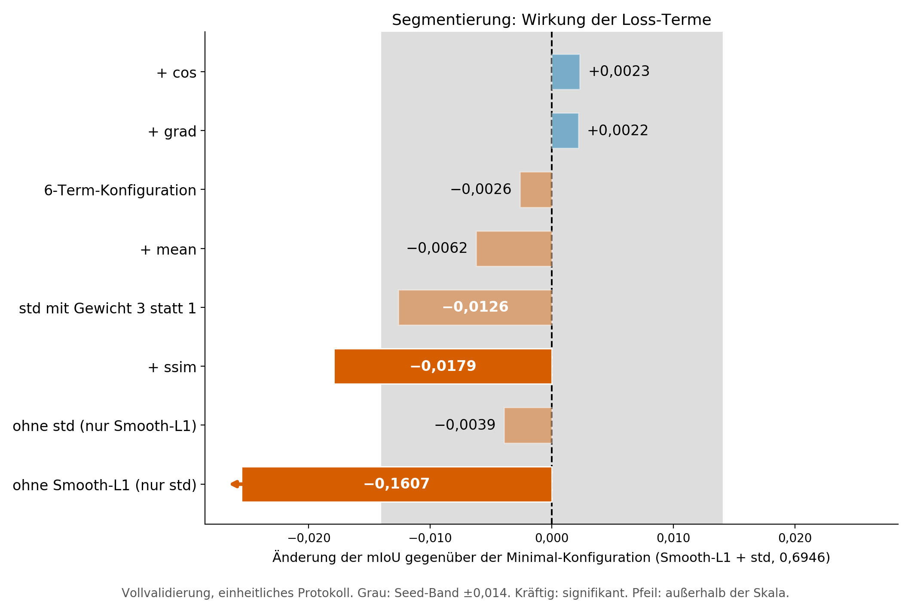
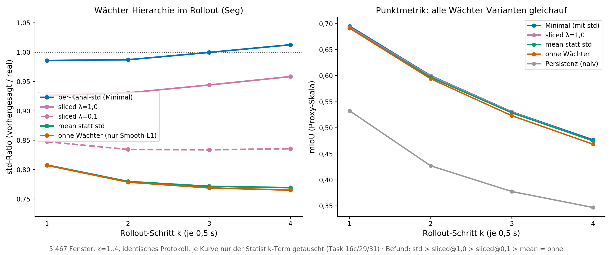
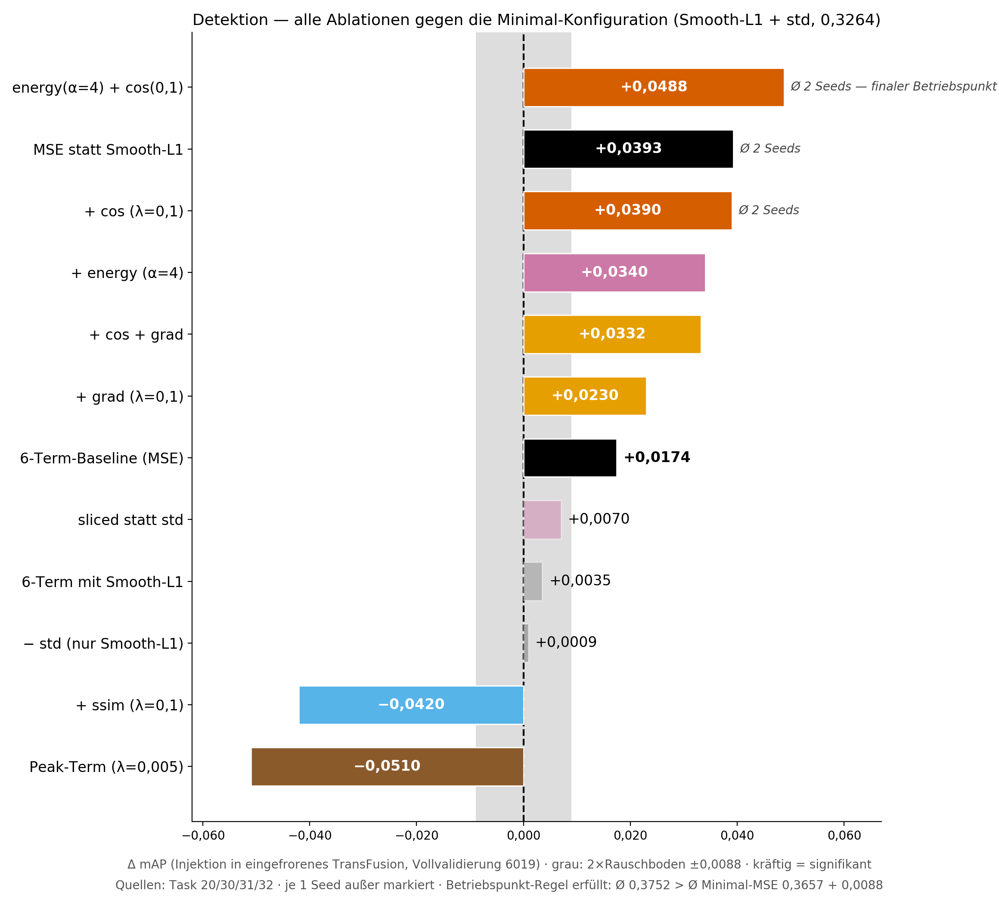

# BEV-Weltmodell: Vorhersage latenter BEV-Repräsentationen für das autonome Fahren

Transformer-basiertes Weltmodell, das die nächste latente BEV-Repräsentation
(kurz: Latent) aus den drei vorherigen Frames vorhersagt. Die Latents stammen
aus den eingefrorenen BEVFusion-Konfigurationen für Segmentierung und
Detektion (nuScenes), abgegriffen nach der Sensorfusion und vor den
Wahrnehmungsköpfen. Ausgewertet werden die Vorhersagen mit den jeweils
zugehörigen eingefrorenen Wahrnehmungsköpfen. Masterarbeit an der
Universität der Bundeswehr München.

## Kernergebnisse

| Metrik (Vollvalidierung, gegen die nuScenes-Annotation) | Persistenz | Weltmodell | Referenz (reales Latent) |
|---|---|---|---|
| Segmentierung (mIoU, 6 Klassen) | 0,4647 | **0,5898** | 0,6295 |
| Detektion (mAP) | 0,1696 | **0,3438** | 0,6858 |

- Zielfunktion: Für die Segmentierung reichen Smooth-L1 und der
  Streuungsterm aus. In der Detektion verbessern Zusatzterme die mAP.
  Details stehen im Abschnitt "Ablation der Zielfunktion" am Ende
  dieses Dokuments.
- Rollout: Das Weltmodell liegt bei jedem Schritt bis k=10 über der
  Persistenz.
- Kopfadaptation: Auf Vorhersagen nachtrainierte Wahrnehmungsköpfe
  verbessern die Segmentierung um 0,011 mIoU und die Detektion um
  0,089 mAP.
- Generative Varianten: CVAE und Flow Matching erzeugen
  unterschiedliche Stichproben, erreichen in mIoU bzw. mAP aber keine
  besseren Werte als das deterministische Modell.
- Laufzeit: Ein Vorhersageschritt benötigt auf einer TITAN RTX etwa
  4,4 ms für die Segmentierung und 11,5 ms für die Detektion.
  Der höchste gemessene PyTorch-Speicherbedarf liegt bei 266 MB.

## Repository-Struktur

```
├── Masterarbeit_VincentMann.pdf   # die vollständige Masterarbeit
├── train_linux.py            # Training (eine Codebasis lokal + Cluster)
├── inference.py              # Proxy-Evaluation Seg (Teilstichprobe mit 300
│                             #   Fenstern; mIoU, Streuungsverhältnis)
├── eval_full_val.py          # Vollvalidierung Seg (5743 Fenster)
├── rollout_eval.py           # autoregressiver Rollout
├── Code/                     # Modell-Module (Dataset, Embedding, Transformer,
│                             #   Output-/Upsampling-Head, Flow-Head, Loss)
├── tools/                    # Kopf-Adaptation: adapt_seg_head.py (Decoder,
│                             #   Seg) und adapt_det_head.py (TransFusion, Det)
├── bevfusion_patch/          # Latent-Extraktion/-Injektion: latent_saver.py
│                             #   + Hook-Anleitung (SAVE_/LOAD_BEV_LATENTS)
├── configs/                  # Beispiel-Configs (beste Betriebspunkte Seg/Det)
├── scripts_render/           # Beispiel-Render-Skript (Abb. 5.8 der Thesis)
│                             #   + gemeinsames Stylesheet thesis_style.py
├── img/                      # Abbildungen dieses Dokuments
├── environment.yml           # Conda-Referenzumgebung (Training/Inferenz)
└── requirements.txt          # dieselbe Umgebung als pip-Variante
```

## Setup

```bash
# Variante Conda (empfohlen):
conda env create -f environment.yml && conda activate bevwm
# Variante pip (Python 3.10, CUDA 12.1):
pip install -r requirements.txt
```

## Daten und Gewichte (nicht im Repo)

Aus Lizenzgründen enthält das Repo weder nuScenes-Daten und -Latents noch
BEVFusion-Gewichte und keine trainierten Checkpoints. Zum Reproduzieren:

1. nuScenes (v1.0-trainval): [nuscenes.org/nuscenes](https://www.nuscenes.org/nuscenes)
   (Download nach Registrierung, nuScenes-Lizenzbedingungen beachten).
2. BEVFusion: offizielles Repo [mit-han-lab/bevfusion](https://github.com/mit-han-lab/bevfusion)
   mit den offiziellen Seg- und Det-Gewichten (`bevfusion-seg.pth` /
   `bevfusion-det.pth`).
3. Latents extrahieren: über den `latent_saver`-Hook im
   BEVFusion-Modell (Env-Schalter `SAVE_BEV_LATENTS`; das Gegenstück
   `LOAD_BEV_LATENTS` injiziert Latents für die annotationsbasierte
   Evaluation). Der Hook stammt aus einer vorangegangenen Projektarbeit
   und liegt zur Reproduzierbarkeit unter
   [`bevfusion_patch/`](bevfusion_patch/) bei (Modul, Einbauanleitung,
   Aufrufbeispiele). Ergebnis: je Split ein Verzeichnis einzelner
   `.npy`-Dateien (Seg: 256×128×128, Det: 256×180×180, fp16).
4. Packen: `python -u Code/pack_latents.py --config <config> --split val
   --dtype float16` (idempotent; memmap-fähige Packs für den Loader).
5. Trainieren: `python -u train_linux.py --config configs/config_seg_beispiel.yaml`
   für den Segmentierungs- bzw.
   `--config configs/config_det_beispiel.yaml` für den
   Detektionsstrang (Pfade an die eigene Umgebung anpassen).
6. Evaluieren: `inference.py` (Proxy-Skala, 300 Fenster),
   `eval_full_val.py` (Vollvalidierung) und `rollout_eval.py`, jeweils
   Seg-Strang. Die annotationsverankerten Metriken (mIoU/mAP gegen die
   nuScenes-Annotation, für Det der einzige Messweg) laufen per
   Latent-Injektion im BEVFusion-Container (`LOAD_BEV_LATENTS`-Hook,
   siehe `bevfusion_patch/`).
7. Kopf-Adaptation (optional): `tools/adapt_seg_head.py` trainiert
   den Seg-Decoder, `tools/adapt_det_head.py` den TransFusion-Kopf auf
   Weltmodell-Vorhersagen nach. Weltmodell und Encoder bleiben dabei
   eingefroren (Thesis, Kapitel Kopfadaptation).

## Checkpoints

Trainierte Gewichte sind nicht Teil des Repos (Größe). Das Weltmodell
ist mit den Configs unter `configs/` aus den extrahierten Latents in
wenigen GPU-Stunden reproduzierbar (Seg ca. 6 M Parameter). Die in der
Thesis verwendeten Checkpoints (Seg- und Det-Betriebspunkt sowie
adaptierte Köpfe, fp16 ca. 11,5 MB je Modell) sind archiviert und auf
Anfrage verfügbar.

## Beispiel: Thesis-Figur rendern

`scripts_render/` zeigt den Aufbau der Thesis-Figuren (gemeinsames
Stylesheet `thesis_style.py`, kleine Ergebnis-JSONs als Datenquelle) am
Beispiel von Abbildung 5.8 (mIoU je Klasse):

```bash
python3 scripts_render/render_beispiel_klassen.py
```

## Ablation der Zielfunktion

Die folgenden Ablationen wurden teilweise nach Abgabe der Masterarbeit
durchgeführt. Sie ergänzen die behandelten Punkte und erweitern die
Ergebnisse. Diese basieren auf einer Vollvalidierung, bei der jeweils
nur ein genannter Term verändert wurde. Referenz ist in beiden
Grafiken die Minimal-Konfiguration aus Smooth-L1 und Streuungsterm.

Verwendete Terme: Smooth-L1 (elementweiser Rekonstruktionsfehler),
std (gleicht die Standardabweichung je Kanal an das reale Latent an),
mean (Gegenstück für den Mittelwert), cos (Kosinus-Ähnlichkeit der
Kanalvektoren je Zelle), grad (Fehler auf Differenzen benachbarter
Zellen), ssim (strukturelle Ähnlichkeit), energy (gewichtet Zellen mit
hoher Aktivierungsenergie des realen Latents stärker), Peak (gleicht
lokale Energiemaxima nach Max-Pooling an), sliced (gleicht die
Werteverteilung über zufällige 1D-Projektionen an). Die
6-Term-Konfiguration ist die in der Thesis verwendete Kombination.

Segmentierung: Kein Zusatzterm verbessert die Minimal-Konfiguration,
ssim verschlechtert die mIoU über das Seed-Band hinaus. Smooth-L1
bestimmt die Gesamtstruktur der Vorhersage. Ohne diesen Term fällt die
mIoU ungefähr auf das Niveau der Persistenz. In diesem Fall wird das
Gate überwiegend in Richtung der letzten beobachteten Repräsentation
verschoben.



Der Streuungsterm verändert die mIoU kaum, wirkt sich aber im
autoregressiven Rollout auf die Statistik der Vorhersagen aus. Ohne
diesen Term fällt das Streuungsverhältnis auf etwa 0,77. Mit
Streuungsterm bleibt es über den untersuchten Horizont nahe 1,0. Der
Mittelwert-Term zeigt diesen Effekt nicht: Die Mittelwerte der Latents
sind über die Frames nahezu konstant, der Term liefert daher kaum
zusätzliche Information. Die Standardabweichung je Kanal bildet
dagegen die Aktivierungsstärke ab. Das sliced Verteilungs-Matching
kalibriert etwas schlechter. In der mIoU liegen
alle vier Varianten innerhalb des Seed-Bands (Abbildung); das Modell
bleibt bei jedem Schritt über der Persistenz.



Bei der Detektion beeinflusst die Wahl der Zielfunktion die mAP
stärker. Der Kosinusterm und die Energiegewichtung verbessern die
Ergebnisse in den durchgeführten Läufen deutlich über den Rauschboden
hinaus. Die beste getestete Konfiguration kombiniert Smooth-L1,
Streuungsterm, Energiegewichtung (Faktor 4) und Kosinusterm (Gewicht
0,1) und erreicht 0,3752 mAP im Mittel über zwei Seeds
(`configs/config_det_beispiel.yaml`).



Die Ergebnisse ergeben ein konsistentes Bild: In den Det-Latents
tragen wenige Zellen mit hoher Aktivierung die Objektinformation.
Terme, die diese Zellen stärker gewichten, verbessern die mAP: die
Energiegewichtung direkt, MSE über die stärkere Bestrafung großer
Abweichungen, der Kosinusterm über den Erhalt der Kanalrichtung je
Zelle. Terme, die lokale Statistiken glätten (ssim) oder nur die
Maxima angleichen (Peak), verschlechtern sie. Der Streuungsterm
verändert wie bei der Segmentierung nur die Statistik der Vorhersagen,
nicht die mAP.

Offene Punkte: Bewegungsbasierte Zellgewichte sind für die Detektion
ungetestet, längere Rollout-Horizonte und Training mit mitlernendem
Kopf wären die nächsten Schritte. Herleitung der Terme, Messprotokolle
und alle Thesis-Ergebnisse stehen in
[`Masterarbeit_VincentMann.pdf`](Masterarbeit_VincentMann.pdf),
Kapitel 3.4 und 5.2.

## Dokumentation

Weitere Details zu Methodik und Experimenten stehen in der Masterarbeit:
[`Masterarbeit_VincentMann.pdf`](Masterarbeit_VincentMann.pdf).

## Lizenz

MIT-Lizenz (siehe [LICENSE](LICENSE)). nuScenes-Daten und
BEVFusion-Gewichte unterliegen den Lizenzen der jeweiligen Anbieter und
sind nicht Teil dieses Repositorys.
